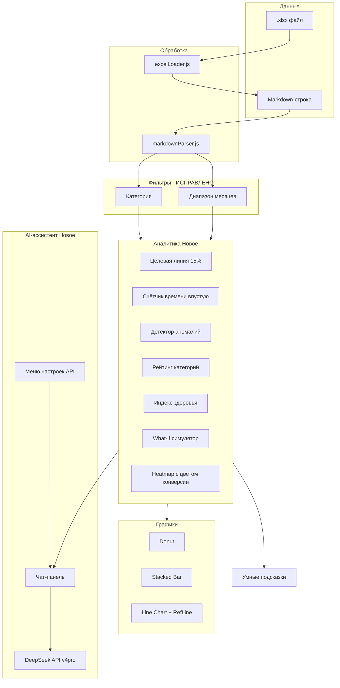

# Этап 3: Аналитические модули + AI-ассистент + исправления

## Диагностика бага фильтров

**Корень:** Несоответствие `value` в `<select>` и ключей в `catMap`.

```js
// select value (строка 409):
<option value="ИМПОРТ - запрос ставки прямое ж/д">Прямое ЖД</option>

// catMap в applyFilters (строка 134):
{ 'rail': 'ИМПОРТ - запрос ставки прямое ж/д', ... }
//        ↑ categoryFilter === 'ИМПОРТ - запрос ставки прямое ж/д'
//          catMap['ИМПОРТ - запрос ставки прямое ж/д'] === undefined → targetCat = undefined
```

**Исправление:** Убрать `catMap`, сравнивать `categoryFilter` напрямую с `r.category` (значения в `<select>` уже полные названия категорий).

---

## Задачи (10 штук)

### 🔧 Блок 0: Исправление

| # | Задача | Файл | Описание |
|---|--------|------|----------|
| 0 | **Починить фильтры** | `Dashboard.jsx` | Убрать `catMap`, сравнивать `categoryFilter` напрямую. Месячный фильтр проверить отдельно |

### 📊 Блок 1: Сильные и слабые стороны на дашборде (идеи 1–5)

| # | Идея | Где на дашборде | Как работает |
|---|------|-----------------|-------------|
| 1 | **Целевая линия конверсии 15%** | Line Chart | Горизонтальная `ReferenceLine` на уровне 15. Месяцы ниже — красная зона |
| 2 | **Счётчик «Время впустую»** | Новый KPI (6-я карточка) | `(формальные + нет связи + клиент пропал) × 7 мин → часы`. Показывает потери времени |
| 3 | **Детектор аномалий** | Новый блок под Heatmap | Авто-подсветка месяцев с отклонением >2σ от среднего |
| 4 | **Рейтинг категорий** | Новый блок между графиками и инсайтами | Таблица: категория → конверсия, заказы, мусор %. Сортировка по конверсии |
| 5 | **Линия «Нет обратной связи»** | Line Chart | Добавить 5-ю линию на график динамики (сейчас скрыта в «Прочие потери») |

### 🧠 Блок 2: Аналитические модули (идеи 6, 7, 10)

| # | Идея | Где на дашборде | Как работает |
|---|------|-----------------|-------------|
| 6 | **Индекс здоровья менеджера** | Новая KPI-карточка | Формула: `(конверсия / 0.33) × (1 – мусор%) × (доля_заказов) × 100`. Одна цифра 0–100, цветовая шкала |
| 7 | **What-if симулятор** | Выдвижная панель (слайдер) | Ползунок: «Сократить мусорные запросы на X%». Пересчёт прогнозной конверсии |
| 10 | **Календарь с цветовой индикацией** | Доработать Heatmap | Добавить градиент красный→жёлтый→зелёный на основе конверсии месяца (не только объёма) |

### 🤖 Блок 3: DeepSeek AI-ассистент

| # | Задача | Файлы | Описание |
|---|--------|-------|----------|
| 11 | **Меню настроек** | `Dashboard.jsx` | Модальное окно: поле для API-ключа DeepSeek, сохраняется в `localStorage` |
| 12 | **Чат-бот панель** | `Dashboard.jsx` | Выдвижная панель справа (ширина ~380px), затемнение фона. Кнопка закрытия |
| 13 | **Логика чата** | `Dashboard.jsx` | `fetch` к DeepSeek API (v4-pro). Системный промт: «Ты ассистент логиста. Анализируй данные запросов...». Контекст: текущие KPI + выводы |
| 14 | **Предзаполненный контекст** | `Dashboard.jsx` | При открытии чат получает сводку: «Дашборд Кубарева. Период: X месяцев. Запросов: N. Конверсия: Y%. Топ-проблема: ...» |

---

## Новая структура интерфейса

```
┌──────────────────────────────────────────────────────────────────┐
│ Header: 📊 Дашборд         [Настройки ⚙️] [☀️/🌙] [💬 Чат]       │
├──────────────────────────────────────────────────────────────────┤
│ Ввод данных + Загрузить .xlsx + Скачать .md + Печать             │
├──────────────────────────────────────────────────────────────────┤
│ [Фильтры: Категория ▼] [Все | 12 | 6 | 3 мес]                    │
├──────────────────────────────────────────────────────────────────┤
│ KPI: 6 карточек (добавлена «Время впустую»)                      │
│ KPI: 1 карточка «Индекс здоровья»                                │
├──────────────────────────────────┬───────────────────────────────┤
│ Donut: Причины потерь            │ Stacked Bar: Категории        │
├──────────────────────────────────┴───────────────────────────────┤
│ Line Chart: Динамика (5 линий, включая «Нет ОС»)                 │
│ + ReferenceLine: цель 15% конверсии                              │
├──────────────────────────────────────────────────────────────────┤
│ Тепловая карта (конверсия цветом, объём цифрой)                   │
├──────────────────────────────────────────────────────────────────┤
│ Детектор аномалий: ⚠️ Апрель 2026 — 98 «нет связи» (в 7× выше)  │
├──────────────────────────────────────────────────────────────────┤
│ Рейтинг категорий: Таблица конверсии                              │
├──────────────────────────────────────────────────────────────────┤
│ What-if симулятор: ползунок «-30% мусора → +X% конверсия»        │
├──────────────────────────────────────────────────────────────────┤
│ Умные подсказки (4 триггера)                                     │
└──────────────────────────────────────────────────────────────────┘

    ┌──────────────────────────┐
    │ 💬 DeepSeek Ассистент    │
    │ ┌──────────────────────┐ │
    │ │ Контекст: 1200 запр. │ │
    │ │ Конверсия: 12.7%     │ │
    │ │ Период: 11 мес.      │ │
    │ ├──────────────────────┤ │
    │ │ User: Почему апрель  │ │
    │ │ провальный?          │ │
    │ │                      │ │
    │ │ AI: Анализ показывает│ │
    │ │ 69% запросов без ОС..│ │
    │ └──────────────────────┘ │
    │ [___________________] [→]│
    └──────────────────────────┘
```

---

## Mermaid-схема архитектуры



---

## Порядок реализации (13 шагов)

| # | Шаг | Блок |
|---|-----|------|
| 0 | **Починить фильтры** (убрать catMap, прямые сравнения) | Блок 0 |
| 1 | Добавить `ReferenceLine` на Line Chart (цель 15%) | Блок 1 |
| 2 | Добавить KPI «Время впустую» (6-я карточка) | Блок 1 |
| 3 | Добавить линию «Нет обратной связи» на Line Chart | Блок 1 |
| 4 | Создать блок «Детектор аномалий» под Heatmap | Блок 1 |
| 5 | Создать блок «Рейтинг категорий» (таблица) | Блок 1 |
| 6 | Добавить KPI «Индекс здоровья» | Блок 2 |
| 7 | Создать What-if симулятор (слайдер + пересчёт) | Блок 2 |
| 8 | Доработать Heatmap: цвет = конверсия | Блок 2 |
| 9 | Создать меню настроек (модальное окно, API-ключ) | Блок 3 |
| 10 | Создать выдвижную чат-панель (UI) | Блок 3 |
| 11 | Реализовать логику чата (fetch DeepSeek API) | Блок 3 |
| 12 | Предзаполнение контекста при открытии чата | Блок 3 |

---

## Файлы для изменения

| Файл | Что изменится |
|------|--------------|
| `src/Dashboard.jsx` | Все 13 шагов в одном файле |
| `src/index.css` | Стили для чат-панели, анимации выезда, меню настроек |

---

## Формулы для расчётов

### Индекс здоровья
```
healthIndex = (conversion / 33) × (1 - junkPct/100) × (totalOrders / totalRequests) × 100
```
- Шкала: 0–100
- Цвет: красный (0–40), жёлтый (40–70), зелёный (70–100)

### What-if симулятор
```
новые_запросы = totalRequests × (1 - мусор%/100 × X/100)
новая_конверсия = totalOrders / новые_запросы × 100
```
Где X — процент сокращения мусора (ползунок 0–100)

---

## Формат API DeepSeek

```js
fetch('https://api.deepseek.com/v1/chat/completions', {
  method: 'POST',
  headers: {
    'Content-Type': 'application/json',
    'Authorization': `Bearer ${apiKey}`
  },
  body: JSON.stringify({
    model: 'deepseek-chat',
    messages: [
      { role: 'system', content: 'Ты ассистент логиста Кубарева Михаила...' },
      { role: 'user', content: 'Вопрос пользователя' }
    ]
  })
})
```
