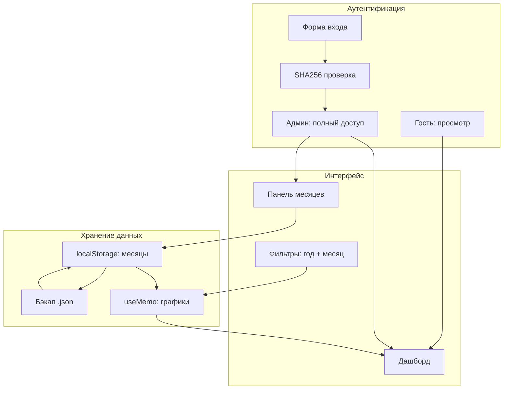

# Этап 5: Хостинг, персистентность, админка, дизайн

## Ответы на вопросы

### Данные на хостинге
На Vercel (статический хостинг) `localStorage` работает в браузере пользователя. Это значит:
- Данные живут в браузере **конкретного устройства**
- При очистке кэша/смене устройства — пропадают
- **Решение:** добавить кнопку «Скачать все данные» (.json) и «Загрузить данные» (.json) — ручной бэкап. Плюс автосохранение в `localStorage`.

### Админка
Чисто клиентская защита ненадёжна. Предлагаю **2-уровневую систему без сервера**:
- **Гость:** видит дашборд, графики, KPI. Не может: удалять/перезаписывать месяцы, менять настройки.
- **Админ:** полный доступ. Аутентификация через **одноразовый код**, который генерируется на основе секретного слова (`muxakub` + `08250825`) и текущей даты. Без сервера это лучшее, что можно сделать для SPA.

Формула: `SHA256(secret + YYYY-MM-DD)` → первые 6 символов. Код меняется ежедневно.

### Цветовая схема
```
Светлая тема: slate-50 фон, white карточки, blue-600 акцент
Тёмная тема:  slate-900 фон, slate-800 карточки, blue-500/indigo-400 акценты
Heatmap:      мягкие пастельные тона (не вырвиглаз)
```

---

## План (14 шагов)

### 🔤 Шаг 1: Шрифты Inter
| Файл | Действие |
|------|----------|
| `index.html` | Добавить `<link>` на Google Fonts Inter (400, 500, 600, 700) |
| `tailwind.config` / `index.css` | Установить `fontFamily: { sans: ['Inter', ...] }` |

### 🎨 Шаг 2: Возврат к тёмно-синему + Lazywebs палитра

Возвращаем `slate-*` для тёмной темы (она уже была хороша). Уточняем цвета:

| Элемент | Светлая | Тёмная |
|---------|---------|--------|
| Фон | `slate-50` | `slate-900` |
| Карточки | `white` | `slate-800` |
| Акцент | `blue-600` | `blue-500` |
| KPI-иконки | `blue-600`, `green-600`, `red-600`, `violet-600`, `amber-600` | `blue-400`, `green-400`, `red-400`, `violet-400`, `amber-400` |
| Текст основной | `slate-900` | `slate-100` |
| Текст вторичный | `slate-500` | `slate-400` |
| Границы | `slate-200` | `slate-700` |
| Heatmap | `slate-100→blue-200→blue-400→blue-600` | `slate-800→blue-900→blue-700→blue-500` |

### 🗄️ Шаг 3: Система хранения данных по месяцам

Новая архитектура данных:

```js
// localStorage key: 'kubarev_monthly_data'
{
  "июнь 2025": {
    manager: "Кубарев Михаил",
    categories: [
      { name: "ИМПОРТ - запрос ставки прямое ж/д", order: 20, dealFell: 0, priceFail: 38, ... }
    ]
  },
  "июль 2025": { ... },
  ...
}
```

**Новый UI: панель управления месяцами**

Под textarea появляется блок «Управление данными»:
- Список сохранённых месяцев с кнопками: ✏️ перезаписать, 🗑️ удалить
- Кнопка «➕ Добавить месяц» — открывает модалку с textarea для вставки нового месяца
- Кнопка «📥 Скачать бэкап (.json)» — сохраняет все данные
- Кнопка «📤 Загрузить бэкап (.json)» — восстанавливает из файла

### 🔐 Шаг 4: Админка (двухуровневая)

| Уровень | Доступ |
|---------|--------|
| **Гость** | Просмотр дашборда, KPI, графиков. Можно применять фильтры. Нельзя: добавлять/удалять/перезаписывать месяцы, менять API-ключ |
| **Админ** | Полный доступ ко всем функциям |

**Вход в админку:**
- Кнопка «🔑 Войти как админ» в хедере
- Модальное окно: ввод логина (`muxakub`) и пароля (`08250825`)
- Пароль проверяется через `SHA256` хеш (хранится в коде)
- При успехе — `sessionStorage.setItem('admin', 'true')`
- Сессия действует до закрытия вкладки

**Защита:** хеш пароля в коде (не сам пароль). Для личного дашборда — достаточно.

### 🔍 Шаг 5: Фильтры по месяцам и годам

Добавить в секцию фильтров:
- **Фильтр по году:** кнопки `2025 | 2026 | Все`
- **Фильтр по месяцу:** multiselect или кнопки `июнь | июль | август | ... | Все`

При выборе года — фильтруются только месяцы этого года. При выборе конкретного месяца — только он.

### 📄 Шаг 6: Инструкция по размещению на Vercel

Создать файл `DEPLOY.md` с пошаговой инструкцией:
1. Установка Vercel CLI: `npm i -g vercel`
2. `vercel login`
3. `vercel` в папке проекта
4. Настройка авто-деплоя из GitHub
5. Как обновлять: `git push` → авто-деплой

### 🎨 Шаг 7: Полировка дизайна (мягкие цвета)

- Heatmap: `slate-100→blue-100→blue-200→blue-400` (светлая), `slate-800→blue-900/40→blue-800/60→blue-600/80` (тёмная) — мягкие пастельные
- Карточки KPI: увеличить `border-radius` до `rounded-2xl` (16px)
- Все графики: скруглённые углы, мягкие тени
- Кнопки: плавные переходы `transition-all duration-200`
- Отступы: увеличить `gap` между секциями до `32px`

### 🧹 Шаг 8: Чистка кода

- Убрать `neutral-850` из `index.css`
- Вернуть `slate` во все `dark:` классы
- Убедиться, что `Inter` применяется глобально

---

## Файлы для изменения

| Файл | Шаги |
|------|------|
| `index.html` | 1 (шрифты) |
| `src/index.css` | 1, 2, 7, 8 |
| `src/Dashboard.jsx` | 3, 4, 5, 7 |
| `DEPLOY.md` 🆕 | 6 |

---

## Порядок реализации

```
Шаг 1: Шрифты Inter
Шаг 2: Палитра (slate + blue)
Шаг 7: Мягкие цвета heatmap
Шаг 8: Чистка neutral-850
Шаг 3: Хранение данных по месяцам (localStorage CRUD)
Шаг 5: Фильтры по месяцам и годам
Шаг 4: Админка (guest/admin)
Шаг 6: DEPLOY.md
```

---

## Mermaid-схема архитектуры



---

## Что ещё не учтено

| Вопрос | Решение |
|--------|---------|
| Данные на разных устройствах | Экспорт/импорт .json файла. Для синхронизации нужен сервер (Vercel KV + API route). Пока — ручной бэкап |
| Обновление на Vercel | `git push` → авто-деплой за 30 секунд |
| Безопасность API-ключа | Уже хранится в `localStorage`. Для продакшена: Vercel Environment Variables + serverless функция-прокси |
| Мобильная версия | Tailwind responsive уже работает. Надо проверить сетку KPI на мобилках |
