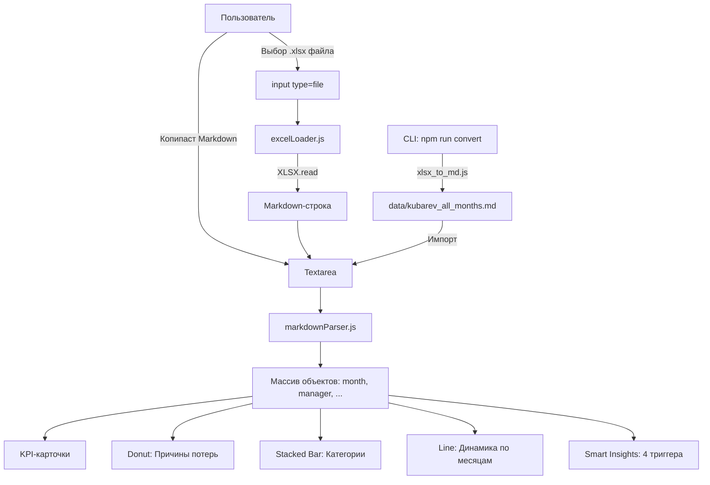

# План: универсальный загрузчик данных (Markdown + Excel → Markdown)

## 1. Концепция

```
                    ┌─────────────────┐
                    │   Dashboard.jsx  │
                    │  (всегда читает  │
                    │   Markdown)      │
                    └────────┬────────┘
                             │
              ┌──────────────┴──────────────┐
              │                             │
     ┌────────┴────────┐          ┌────────┴────────┐
     │ Загрузка .md    │          │ Загрузка .xlsx  │
     │ (прямо в        │          │ → авто-конверт  │
     │  textarea)      │          │   в Markdown    │
     └─────────────────┘          └────────┬────────┘
                                           │
                                  ┌────────┴────────┐
                                  │ scripts/        │
                                  │ xlsx_to_md.js   │
                                  │ (Node.js + xlsx)│
                                  └─────────────────┘
```

Приложение **всегда работает с Markdown** как с внутренним форматом. Excel — просто ещё один способ ввода, который прозрачно конвертируется.

---

## 2. Архитектура решения

### Файлы, которые нужно создать

| Файл | Назначение |
|------|------------|
| `scripts/xlsx_to_md.js` | CLI-скрипт: читает `.xlsx`, пишет `.md`. Можно запустить вручную или вызывать из Dashboard |
| `scripts/xlsx_to_md_wasm.js` | (Опционально) Запасной вариант без Node.js — но для простоты используем npm-пакет `xlsx`, он уже установлен |
| `src/markdownParser.js` | Чистая функция: принимает Markdown-строку → возвращает массив объектов `{ month, manager, category, order, ... }` |
| `src/excelLoader.js` | Хук/утилита: принимает File (.xlsx), читает через FileReader, отдаёт Markdown-строку |
| `data/kubarev_all_months.md` | Эталонный Markdown-файл: результат конвертации всех 11 вкладок Excel |

### Файлы, которые нужно изменить

| Файл | Что изменить |
|------|--------------|
| `src/Dashboard.jsx` | Добавить: кнопка «Загрузить .xlsx», индикатор формата, вызов `excelLoader` |
| `src/defaultData.js` | Заменить tab-формат на Markdown-строку |
| `package.json` | Добавить скрипт `"convert": "node scripts/xlsx_to_md.js"` |

### Файлы, которые можно удалить

| Файл | Причина |
|------|---------|
| Tab-формат в `src/defaultData.js` | Заменён на Markdown |
| `xlsx` из runtime-зависимостей | Оставить только в `devDependencies` (нужен только для скрипта конвертации) |

---

## 3. Детали реализации

### 3.1. Скрипт `scripts/xlsx_to_md.js`

```mermaid
flowchart LR
    A[.xlsx файл] --> B[Читаем xlsx]
    B --> C[Перебираем вкладки: июнь25...апрель26]
    C --> D[sheet_to_json с header:1]
    D --> E[Формируем Markdown-таблицу]
    E --> F[## июнь 2025\n| Исполнитель | ...]
    F --> G[Сохраняем data/output.md]
```

- Принимает путь к `.xlsx` как аргумент командной строки
- Если аргумент не передан — ищет `кол-во запросов *.xlsx` в корне
- Выводит результат в `data/kubarev_all_months.md`
- Этот же скрипт можно вызвать из `package.json` → `npm run convert`

### 3.2. Парсер Markdown `src/markdownParser.js`

```mermaid
flowchart TD
    A[Markdown-строка] --> B[Разбить на строки]
    B --> C{Строка начинается с ##?}
    C -->|Да| D[Запомнить месяц]
    C -->|Нет| E{Строка — это строка таблицы? \\| ... \\|}
    E -->|Да| F{Это заголовок таблицы?}
    F -->|Да| G[Пропустить]
    F -->|Нет| H{Это разделитель? \\|---\\|}
    H -->|Да| G
    H -->|Нет| I[Разобрать ячейки \\| name \\| cat \\| nums... \\|]
    I --> J[Добавить объект в массив]
    J --> B
    E -->|Нет| B
```

Правила парсинга Markdown-таблицы:
1. Строка должна начинаться с `|` и заканчиваться `|`
2. Пропускаем строку-разделитель (содержит `---`)
3. Пропускаем строку-заголовок (первая `|`-строка после `##` или после разделителя)
4. Разбираем ячейки: `split('|')`, `trim()`, пустое → 0
5. Порядок колонок фиксирован: Исполнитель, Категория, Заказ, Сделка сорвалась, Не прошли по цене, Долго считали, Клиент не отвечает, Формальный запрос, Нет обратной связи, Всего

### 3.3. Загрузчик Excel `src/excelLoader.js`


Ключевой момент: **конвертация происходит в браузере**, без Node.js на бэкенде. Пакет `xlsx` умеет работать и в браузере (читает ArrayBuffer).

Важно: нужно перенести `xlsx` из `devDependencies` обратно в `dependencies` — он нужен в рантайме браузера для чтения `.xlsx`.

### 3.4. Интерфейс Dashboard

Новый вид секции ввода данных:

```
┌─────────────────────────────────────────────┐
│  📁 Импорт данных                            │
│                                              │
│  ┌──────────────────────────────────────┐    │
│  │ markdown-текст или вставьте данные... │    │
│  │                                      │    │
│  └──────────────────────────────────────┘    │
│                                              │
│  [📄 Загрузить .xlsx]  [🔍 Анализировать]    │
│  [📥 Скачать .md]                              │
│                                              │
│  Формат: Markdown ▼  • Распарсено: 47 строк  │
└─────────────────────────────────────────────┘
```

Новые элементы:
- **Кнопка «Загрузить .xlsx»** — открывает `<input type="file" accept=".xlsx,.xls">`
- После выбора файла — автоматическая конвертация в Markdown, текст вставляется в textarea
- **Селект формата** (только индикатор, не редактируется) — показывает «Markdown» или «Excel (конвертирован)»
- **Кнопка «Скачать .md»** — сохраняет текущий текст как `kubarev_data.md`
- **Счётчик распарсенных строк** — обновляется в реальном времени

---

## 4. Порядок реализации (шаги)

| # | Шаг | Зависит от | Результат |
|---|-----|-----------|-----------|
| 1 | Создать `scripts/xlsx_to_md.js` | xlsx уже установлен | CLI-конвертер, `npm run convert` |
| 2 | Запустить скрипт → создать `data/kubarev_all_months.md` | Шаг 1 | Markdown-файл со всеми 11 месяцами |
| 3 | Создать `src/markdownParser.js` | — | Функция `parseMarkdownTable(str)` |
| 4 | Создать `src/excelLoader.js` | xlsx | Функция `loadExcelFile(file)` → Markdown |
| 5 | Обновить `src/defaultData.js` | Шаг 2 | Импорт Markdown-строки из `.md` файла |
| 6 | Обновить `src/Dashboard.jsx` | Шаги 3, 4, 5 | Новый интерфейс: загрузка .xlsx, индикатор формата |
| 7 | Удалить старый tab-парсер из Dashboard | Шаг 6 | Чистый код |
| 8 | Обновить `package.json` (скрипты + xlsx в deps) | — | `npm run convert` + xlsx доступен в браузере |
| 9 | Протестировать: открыть .md → парсинг | Шаг 3 | Данные корректны |
| 10 | Протестировать: загрузить .xlsx → авто-конверт → парсинг | Шаг 4 | Данные корректны |

---

## 5. Вопросы к Михаилу

| # | Вопрос | Варианты |
|---|--------|----------|
| 1 | При загрузке `.xlsx` автоматически анализировать (без нажатия «Анализировать») или требовать ручного подтверждения? | Автоматически / По кнопке |
| 2 | Сохранять ли загруженный Markdown в `localStorage` между сессиями? | Да / Нет |
| 3 | Нужна ли кнопка «Скачать .md» для экспорта текущих данных? | Да / Нет |
| 4 | Продолжаем фильтровать только Кубарева Михаила или убрать фильтр (раз данные и так только его)? | Только Кубарев / Убрать фильтр |

---

## 6. Mermaid-схема итоговой архитектуры


